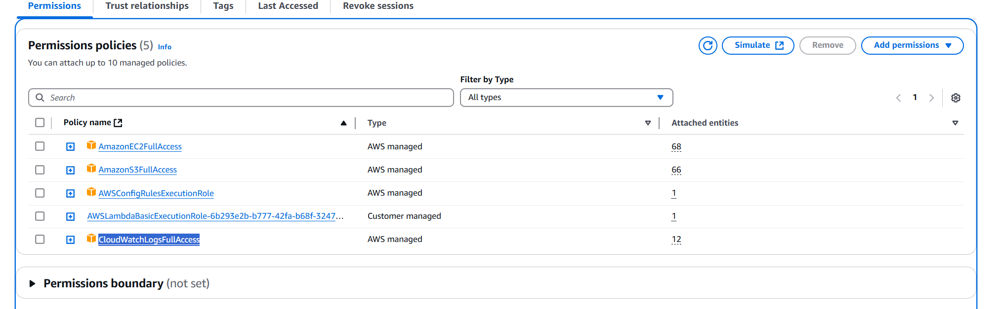
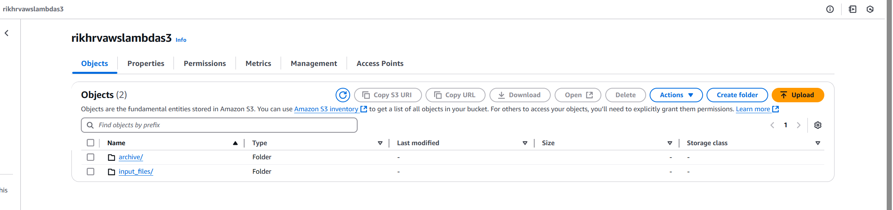
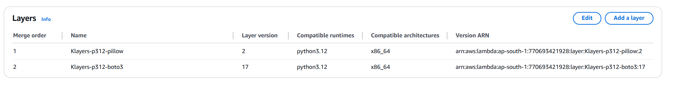
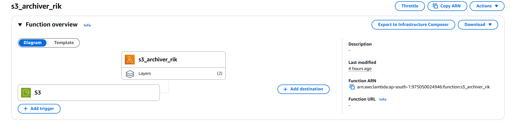
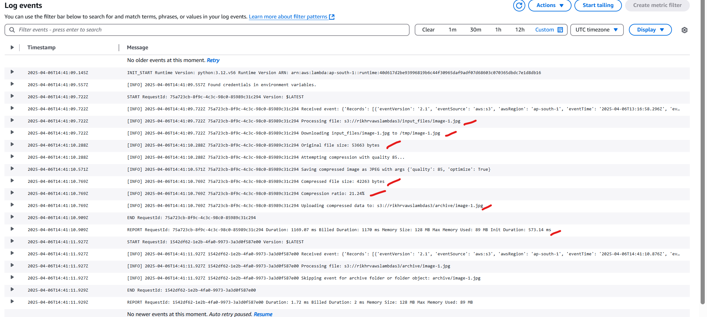

# AWS_lamda_Metadata

# Scenario

Create an AWS Lambda Function, it will be triggered when an image is uploaded to S3, it will compress the size and save it to S3 bucket
______

## 1. Create IAM role/Policy to support Lambda 

As we are uploading images through S3, creating new images in S3. Please make sure to provide atleast.

    1. AmazonS3FullAccess
    2. CloudWatchLogsFullAccess 



## 2. Create an S3 bucket.

Since we are using an S3 for the AWS lambda function, we upload the files into ``input_files ``, and AWS Lambda reduces the file size using ```Pillow``` and pushes the files to ``archive```. 

Create the S3 bucket and create folders. 



## 3. Create and configure Lambda. 

- Create a Lambda function and configure S3 as a trigger with the earlier created IAM role. As we are using ```boto3``` and ```pillow``` in Lamda. 

- We are using ARN to configure it. 
    - I have used [Klayers git](https://github.com/keithrozario/Klayers) to add 2 layers to the Function. 
    - Based on AWS region, select appropriate Python-supported ARN [python 3.12 ARN ](https://github.com/keithrozario/Klayers/tree/master/deployments/python3.12)




- Alternate method to add ```pillow``` and ```boto 3```

    - Dependencies (Pillow):
        Pillow is not included in the standard Lambda runtime. You need to include it in your deployment package.

    - (ZIP Upload): Create a deployment package locally.
        ```
        mkdir lambda_package
        pip install Pillow -t ./lambda_package
        cp lambda_function.py ./lambda_package/
        cd lambda_package
        zip -r ../deployment_package.zip .
        cd ..
        ```
    - Follow similar steps for boto3 

## 4. Configure Lambda Function 
- Create a new Lambda function named s3_archiver.
- Choose the Python 3.x runtime.
- Paste the Python code into the Lambda code editor or upload it as a .zip file.
- Set the Handler to lambda_function.lambda_handler.
- Create a test scenario using JSON and save a private test 
- Deploy and test the function. 


